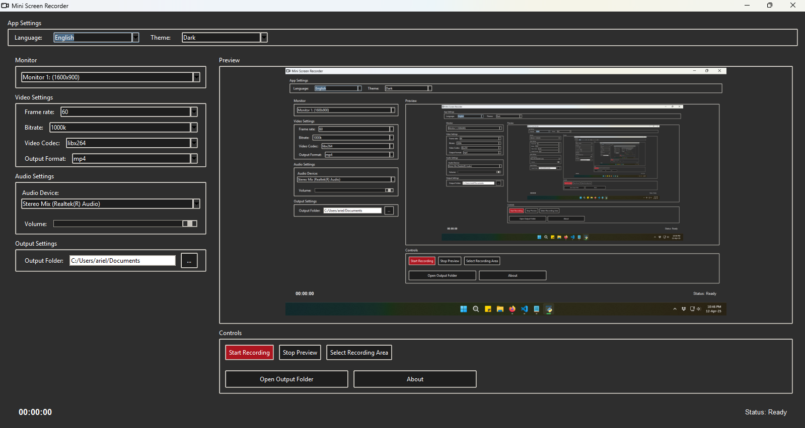

# Mini Screen Recorder

An open-source screen and audio recorder for **Windows** and **Linux**, written in Python.

<p align="center">
  
</p>

---

## 🎯 Features

- Multiple themes to customize the look and feel of the app
- Set frame rate and bitrate
- Choose video codec
- Select output format (mp4, mkv)
- Select audio input or output device
- Select screen area or full screen to record
- Multi-monitor support
- Multi-language support

---

## 🎥 Video Demo

Simple gameplay recorded using this app (Just a demo, this app is not made to record gameplays).  
Click below to watch:

[](https://youtu.be/7Ji-maVmPac)

---

## ⚙️ How to Run

The main file to run the app on **any platform** is:

```bash
python app.py
```

---

## 💻 Requirements

You need **Python 3.x** and **FFmpeg** installed, along with some additional libraries. The Windows version already comes with ffmpeg, you don't need to do anything. For the Linux version you must install ffmpeg.

> `miniscreenrecorder.py` and `miniscreenrecorderLinux.py` are optional helpers that display platform-specific warnings.

---

### 🪟 Windows

If you're using the packaged `.exe` from the [Releases](https://github.com/Lextrack/MiniScreenRecorder/releases), you **don't need to install anything** — Python, FFmpeg, and all dependencies are bundled.

If you're running the source code, install Python first, then install the dependencies:

```bash
pip install pillow mss numpy opencv-python screeninfo
```

---

### 🐧 Linux (Debian-based: Ubuntu, Mint, etc.)

#### 1. Install Python and dependencies

```bash
sudo apt-get update
sudo apt install python3 python3-pip python3-venv python3-tk
```

#### 2. (Optional) Create and activate a virtual environment

```bash
python3 -m venv venv
source venv/bin/activate
```

#### 3. Install required Python packages

```bash
pip install pillow mss numpy opencv-python screeninfo
```

#### 4. Install FFmpeg

```bash
sudo apt install ffmpeg
```

To verify the installation:

```bash
ffmpeg -version
```

---

## ⚠️ Known Issues

### UAC Prompt (Windows)

To avoid screen dimming while recording, go to *User Account Control Settings* and select:

> **"Notify me only when apps try to make changes to my computer (do not dim my desktop)"**

Or disable UAC entirely (not recommended for most users).

### Choppy Recording

If the recording isn’t smooth, try the following configuration for better results:

- **Codec:** `libx264`
- **Format:** `mkv`

### System Audio Not Captured

To record system audio on Windows, enable **Stereo Mix** in your Sound settings  
(*Recording* tab → Right-click → Show Disabled Devices → Enable Stereo Mix).

---

## 📄 License

This project is licensed under the MIT License.
